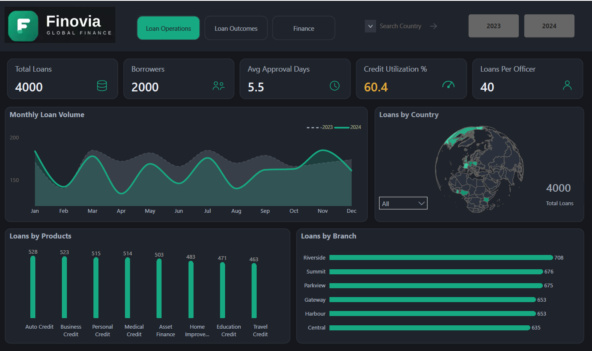
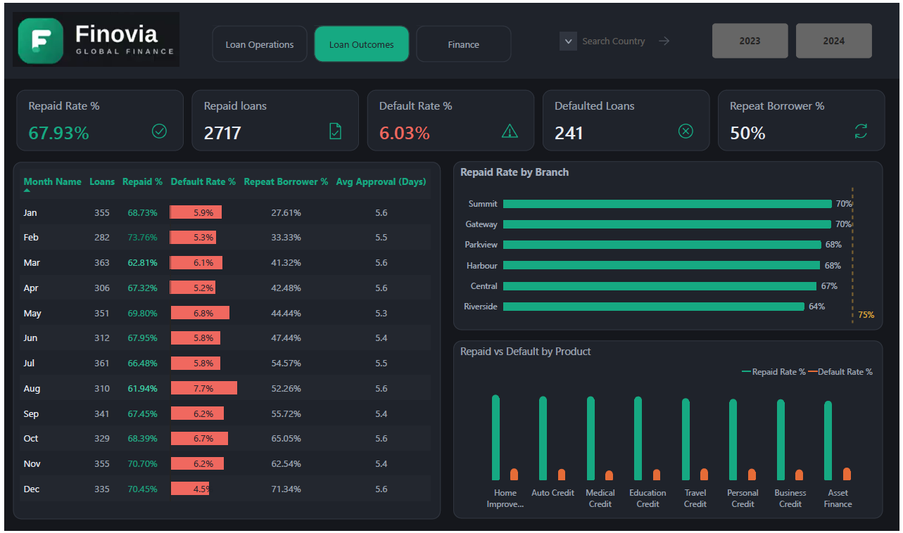
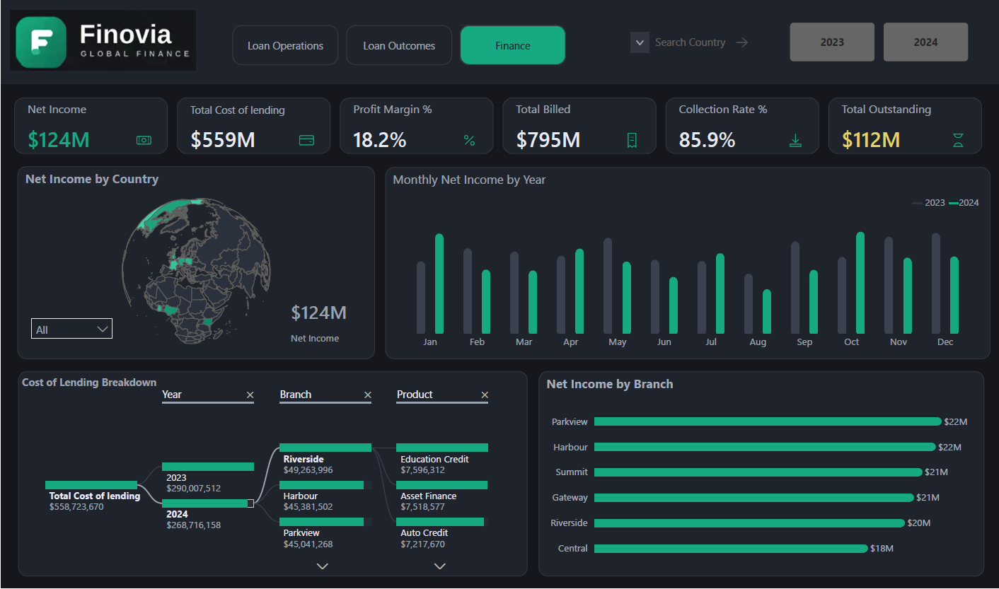

# Finovia Loan Portfolio & Financial Performance Analysis

**Power BI | Financial Services | Loan Portfolio Analysis | Business Intelligence**

## Overview

Finovia Global Finance is a simulated digital consumer lender operating across multiple markets. This project analyses **4,000 loans across 2023–2024** to evaluate operational efficiency, repayment performance, credit risk, collections, and profitability.

I developed a three-page **Power BI management dashboard** covering **Loan Operations, Loan Outcomes, and Financial Performance**, enabling decision-makers to move beyond loan volume and evaluate how lending activity translates into portfolio quality and financial performance.

---

## Key Results at a Glance

| Portfolio | Loan Outcomes | Financial Performance |
|---|---|---|
| **4,000** total loans | **67.93%** repayment rate | **$795M** billed |
| **2,000** unique borrowers | **6.03%** default rate | **$683M** collected |
| **5.5 days** avg. approval time | **50%** repeat borrowers | **$124M** net income |
| **60.4%** credit utilisation | **2,717** repaid loans | **18.2%** profit margin |

> **Key finding:** Lending volume alone does not provide a complete picture of performance. The analysis highlights the importance of evaluating portfolio growth alongside repayment quality, default exposure, collections, and profitability.

---

# Dashboard

## 1. Loan Operations



### Operational Performance

The Operations dashboard examines portfolio scale, lending efficiency, geographic distribution, product mix, and branch activity.

**Key findings:**

- **4,000 loans** were issued to **2,000 unique borrowers**.
- Average approval time was approximately **5.5 days**.
- Average credit-limit utilisation stood at **60.4%**.
- Loan officers managed an average of **40 loans each**.
- **Auto Credit** recorded the highest product volume with **528 loans**.
- **Riverside** processed the highest branch volume with **708 loans**.

The results provide management with a baseline for comparing lending activity with the repayment and financial outcomes shown on subsequent dashboard pages.

---

## 2. Loan Outcomes



### Repayment & Portfolio Risk

The Loan Outcomes dashboard evaluates portfolio quality through repayment behaviour, defaults, repeat borrowing, branch performance, and product outcomes.

**Key findings:**

- **2,717 loans were repaid**, producing a **67.93% repayment rate**.
- The repayment rate remains below the dashboard's **75% target**.
- **241 loans defaulted**, representing a **6.03% default rate**.
- Repeat borrowers accounted for approximately **50%**.
- Branch and product comparisons reveal that portfolio quality should be evaluated separately from lending volume.

The gap between the **67.93% actual repayment rate and 75% target** indicates an opportunity to investigate which products, branches, and borrower segments contribute most to weaker repayment performance.

---

## 3. Financial Performance



### Collections & Profitability

The Finance dashboard connects lending activity and repayment outcomes to collections, lending costs, and profitability.

**Key findings:**

- Approximately **$795M** was billed.
- Approximately **$683M** was collected.
- Approximately **$112M** remained outstanding.
- Collection rate reached **85.9%**.
- Total lending costs were approximately **$559M**.
- Net income reached approximately **$124M**.
- Overall profit margin was approximately **18.2%**.

The financial results reinforce the importance of assessing portfolio growth alongside collections and lending costs. Higher lending activity creates value only when loans are successfully collected at sustainable cost.

---

# Business Problem

Management needed a consolidated view of lending performance across its markets.

Although detailed loan-level information was available, identifying trends and comparing operational, repayment, and financial performance was difficult without an interactive reporting solution.

The analysis therefore focused on four management questions:

1. **Operational Efficiency:** How efficiently is Finovia processing and distributing loans?
2. **Portfolio Distribution:** Which branches, products, and markets account for the greatest lending activity?
3. **Portfolio Quality:** How strong are repayment and default outcomes?
4. **Financial Performance:** How effectively does lending activity translate into collections and profitability?

---

# Key Business Insights

### 1. Loan volume alone is not enough to assess performance

Riverside recorded the highest branch loan volume, but volume should be interpreted alongside repayment, default, collection, and profitability measures.

A high-volume branch is not necessarily the strongest-performing branch if portfolio quality or financial returns are weaker.

### 2. Repayment performance requires attention

The overall **67.93% repayment rate** is approximately **7 percentage points below the 75% target**.

This suggests that management should investigate the branches, products, and borrower segments contributing most to the repayment gap.

### 3. Portfolio averages can conceal credit-risk differences

The overall default rate is **6.03%**.

While useful as a headline measure, portfolio-level averages may hide differences between products and branches. More granular monitoring can therefore support earlier identification of emerging risk.

### 4. Outstanding collections represent a material opportunity

Approximately **$112M remains outstanding**.

Further analysis of outstanding balances by branch, product, and loan status could help management identify where collection activity should be prioritised.

### 5. Portfolio growth must translate into profitable collections

Finovia generated approximately **$124M in net income** and an **18.2% profit margin**.

The results demonstrate why management should evaluate lending growth together with repayment quality, collection performance, and cost rather than using loan volume as the primary measure of success.

---

# Recommendations

**Strengthen repayment performance**  
Investigate branches and products with below-average repayment outcomes and identify the factors contributing to the gap against the 75% target.

**Prioritise outstanding collections**  
Segment the approximately **$112M outstanding balance** by branch, product, and loan status to identify areas where collection activity could have the greatest impact.

**Monitor product and branch credit risk**  
Track repayment and default performance below portfolio level to identify areas where increasing loan activity may be accompanied by disproportionate risk.

**Adopt balanced branch performance measures**  
Evaluate branches using a combination of loan volume, repayment rate, default exposure, collections, and profitability rather than loan count alone.

**Benchmark stronger-performing areas**  
Identify practices associated with stronger repayment or financial performance and assess whether they can be replicated elsewhere in the portfolio.

---

# Analytical Approach

The project followed a business-focused reporting workflow:

**Business Requirements → KPI Selection → Dashboard Design → Performance Analysis → Insight Generation → Recommendations**

The analysis was organised across three interconnected perspectives:

| Analysis Area | Business Focus |
|---|---|
| **Loan Operations** | Volume, borrowers, approval efficiency, utilisation, products, branches and markets |
| **Loan Outcomes** | Repayment, defaults, repeat borrowing and portfolio quality |
| **Finance** | Billing, collections, outstanding balances, lending costs, net income and profitability |

This structure allows management to connect **what was lent → how those loans performed → what financial value they generated**.

---

# Tools & Skills

### Tools

- **Microsoft Power BI** — interactive dashboard development and visual analysis
- **Microsoft Excel** — source dataset

### Power BI & Analytical Skills

- Multi-page dashboard development
- KPI design and performance monitoring
- Page navigation, slicers, and interactive filtering
- Time-series and trend analysis
- Geographic analysis
- Matrix and decomposition analysis
- Conditional formatting
- Loan portfolio analysis
- Repayment and default analysis
- Branch and product performance analysis
- Financial performance analysis
- Data visualisation and dashboard design
- Business insight generation
- Data storytelling
- Management recommendations

---

# Dataset

The simulated dataset covers lending activity across **2023 and 2024** and contains information relating to:

- Loans and borrowers
- Loan officers and officer tiers
- Products, branches, and countries
- Repayment plans and loan status
- Approval waiting time
- Credit-limit utilisation
- Repeat-borrower behaviour
- Processing, servicing, credit-assessment, and funding costs
- Amount billed and collected
- Net income

For field-level definitions, see the **[Data Dictionary](documentation/data_dictionary.md)**.

---

# Repository Structure

```text
finovia-loan-portfolio-analysis/
│
├── README.md
│
├── data/
│   └── Finovia_Loan_Data.xlsx
│
├── images/
│   ├── loan_operations_dashboard.png
│   ├── loan_outcomes_dashboard.png
│   └── finance_dashboard.png
│
└── documentation/
    └── data_dictionary.md
```

---

# Project Context

Finovia Global Finance is a **simulated company**, and the dataset used in this analysis is training data.

The project is presented as part of my data analytics portfolio to demonstrate my ability to translate business requirements and data into an interactive Power BI reporting solution, identify performance patterns, and communicate actionable business insights.

---

## Author

**Ifeoma Edeh**

**Data Analyst | Power BI | Excel | SQL | Data Visualisation**
